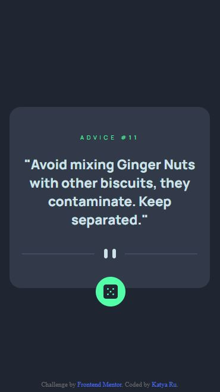
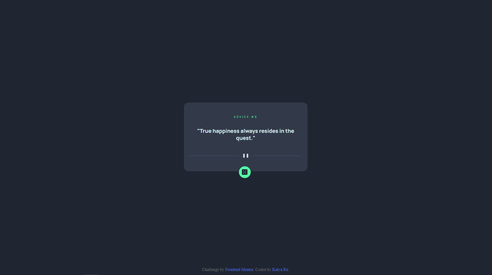

# Frontend Mentor - Advice generator app solution

This is a solution to the [Advice generator app challenge on Frontend Mentor](https://www.frontendmentor.io/challenges/advice-generator-app-QdUG-13db).

## Table of contents

- [Overview](#overview)
  - [The challenge](#the-challenge)
  - [Screenshot](#screenshot)
  - [Links](#links)
- [My process](#my-process)
  - [Built with](#built-with)
- [Author](#author)

## Overview

### The challenge

Users should be able to:

- View the optimal layout for the app depending on their device's screen size
- See hover states for all interactive elements on the page
- Generate a new piece of advice by clicking the dice icon

### Screenshot

The designs created to the following widths:

- Mobile: 375px

- Desktop: 1440px

### Links

- [Live Site URL](https://frontend-challenges-projects.vercel.app/advice-generator-app/index.html)

## Process

### Built with

- Semantic HTML5 markup
- SCSS
  - Flexbox
  - Grid
  - Varibals
- Mobile-first workflow
- JavaScript
  - Fetch

## Author

- Website - [Katya Rukosuev](https://www.katya-ru-fullstack.com//)
- Frontend Mentor - [@RuKatya](https://www.frontendmentor.io/profile/RuKatya)
- Linkedin - [Katya Rukosuev](https://www.linkedin.com/in/katya-rukosuev/)
