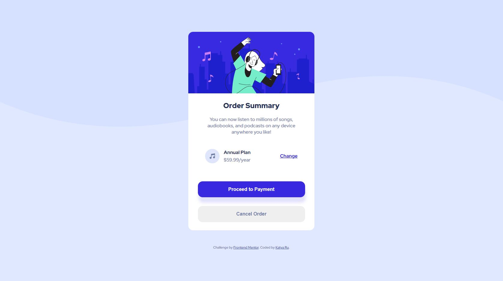

# Frontend Mentor - Order summary card solution

This is a solution to the [Order summary card challenge on Frontend Mentor](https://www.frontendmentor.io/challenges/order-summary-component-QlPmajDUj).

## Table of contents

- [Overview](#overview)
  - [The challenge](#the-challenge)
  - [Screenshot](#screenshot)
  - [Links](#links)
- [Process](#process)
  - [Built with](#built-with)
- [Author](#author)

## Overview

This project is my first experiment with a similar task. I tried to create a component as close as possible to the design.
To create the component, I decided to use HTML tags, and SCSS.

### The challenge

The challenge is to build out the order summary card component and get it looking as close to the design as possible.
Your users should be able to:

- See hover states for interactive elements

### Screenshot

The designs created to the following widths:

- Mobile: 375px

- Desktop: 1440px

### Links

- Solution URL: [Github](https://github.com/RuKatya/Frontend_Projects/tree/main/order-summary)

## Process

### Built with

- Semantic HTML5 markup
- SCSS
  - Flexbox
  - CSS Grid
- Mobile first

## Author

- Website - [Katya Rukosuev](https://katya-ru.herokuapp.com/)
- Frontend Mentor - [@RuKatya](https://www.frontendmentor.io/profile/RuKatya)
- Linkedin - [Katya Rukosuev](https://www.linkedin.com/in/katya-rukosuev/)
